# Commercial Protection & Anti-Piracy Lifecycle (RenWork 商业防复刻与安全打包规范)

This reference documents how RenWork protects Agent Skills and commercial automation workflows from prompt piracy, source code theft, multi-machine unauthorized sharing, and store-carousel exploitation.

---

## 1. The Threat Model for Commercial Agent Skills

When commercializing AI Agent Skills or automated Python workflows:
1. **Plaintext Prompt & Code Theft**: Unprotected markdown prompts (`SKILL.md`) and Python scripts (`scripts/*.py`) can be inspected, copied, and redistributed without authorization.
2. **Carousel & Multi-Machine Piracy**: A single customer purchases 1 license and shares it across 50 devices, or repeatedly switches stores within a single window to manage dozens of client accounts without paying per store.
3. **No Remote Recourse**: Offline-only licenses cannot be revoked if a customer requests a chargeback, leaks their key, or violates terms of service.
4. **Cloud Network Fragility**: Cloud-only verification fails when users face corporate firewalls or regional telecom blocking (e.g. Russian domestic networks), creating severe customer support crises.

---

## 2. The 4-Tier Zero-Trust Commercial Protection Architecture

RenWork enforces a hybrid zero-trust protection model across four coordinated tiers:

```mermaid
graph TD
    subgraph "Tier 1: Hardware & Asymmetric Signature"
        A[Motherboard + CPU + Disk Serial] --> B[Machine ID: MID-XXXX-XXXX-XXXX-XXXX]
        B --> C[RSA-2048 Private Key Sign / Public Key Verify]
    end
    subgraph "Tier 2: Native Binary Obfuscation"
        D[PyArmor C-Extension Compilation] --> E[.pyd / .so Native Binaries]
        E --> F[100% Plaintext Source Stripping]
    end
    subgraph "Tier 3: Multi-Tenant Mutex Isolation"
        G[Single-Window 1:1 Store Mutex] --> H[Max 1-Switch Quota: switch_count <= 1]
        H --> I[Permanent Lock & Anti-Bypass Deadlock]
    end
    subgraph "Tier 4: Serverless Edge Licensing"
        J[Cloudflare Workers Edge Gateway] --> K[Cloudflare KV Real-Time State]
        K --> L[Web Admin Dashboard: Online Ban & Renew]
    end
```



### Tier 1: Hardware Machine ID & RSA-2048 Signature
- Hardware fingerprint derived from Win32 CIM instances / macOS `IOPlatformUUID` / Linux `/etc/machine-id`.
- Salted SHA-256 digest formatted as `MID-XXXX-XXXX-XXXX-XXXX`.
- Vendor signs payload using RSA-2048 with PSS padding and SHA-256. Private key stays strictly offline.

### Tier 2: PyArmor Native C-Extension Obfuscation
- Compiles Python scripts into native `.pyd` Windows binaries.
- Strips all original `.py` source files from the distribution package.
- Built-in security leak audit traverses the release directory to ensure zero private keys, API keys, or plaintext source logic exist.

### Tier 3: Store Mutex & 1-Switch Quota Limit
- Every session window is restricted to exactly **one** store profile.
- Commercial sessions allow at most **1 store switch** (`switch_count <= 1`) to correct mistakes.
- After 1 switch, the window enters permanent lock mode. Further switch attempts or unbind bypasses are blocked.

### Tier 4: Cloudflare Workers Edge Gateway & Resilient Fallback
- Deployed to Cloudflare Workers with KV (`WB_LICENSES`) at zero server maintenance cost.
- Provides real-time remote banning (`POST /admin/api/ban`), token renewal, and usage analytics.
- **Resilient Dual-Engine**: Automatically falls back to offline RSA hardware verification during network outages, but enforces immediate termination if Cloudflare returns `403 BANNED`.

---

## 3. CLI Operations

### 1. Retrieve Machine Hardware ID
```bash
python scripts/renwork-skills machine-id
```

### 2. Issue a Commercial License
```bash
python scripts/renwork-skills issue-license \
    --key admin_private_key.pem \
    --mid "MID-XXXX-XXXX-XXXX-XXXX" \
    --name "Client Name" \
    --days 365
```

### 3. Compile and Protect Any Skill
```bash
python scripts/renwork-skills protect \
    --skill path/to/skill \
    --output dist \
    --name "my-skill-v1.0-protected" \
    --public-key public_key.pem
```
